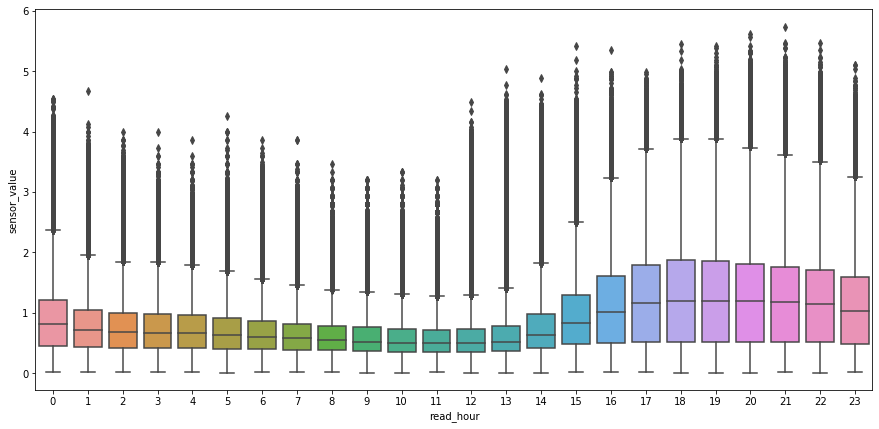
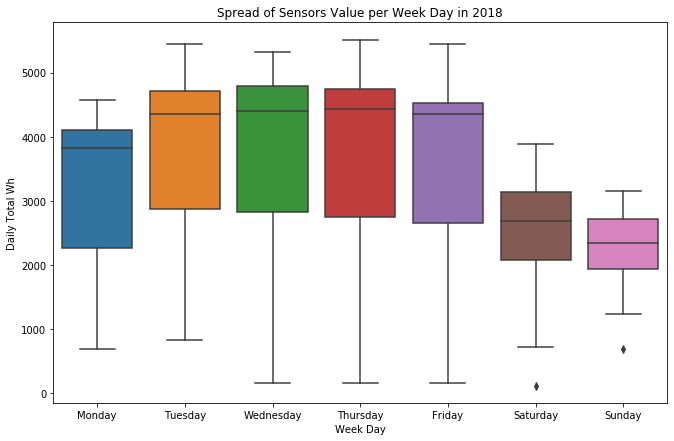

# Delta Fellowship:  Energy Consumption Metrics for the Mat-Su School District
As a Delta Analytics Fellow, I worked with a team of five to help our non-profit partner, the Alaska Housing Finance Corporation, reduce energy consumption across their stock of schools. 

**Executive Summary** 
The Matanuska-Susitna Borough School District (shortened to Mat-Su) is large school district in Alaska, covering an area larger than the entire state of West Virginia. This large area also represents a large body of students; it's the second largest school District in Alaska.

Energy and electricity are important in Alaska. Much of the year is cold and dark, and the high cost of electricity means it represents a large part of school budgets.

Using energy consumption data from schools across the district, I was able to analyze consumptions patterns of the schools and identify inefficiencies. Our **goal** was to uncover inefficient usage patterns and provide a succinct, actionable metric for school administrators to understand their school's performance.

**Analysis** 
While analyzing the data, I uncovered disparities in school vs non-school hour electricity consumption across the various schools.

 To determine what time granularity constituted the 'low-hanging fruit' for inefficiency, I also looked at electricity consumption across days of the week, specifically interested in weekend vs weekday consumption.

**Result** 
Given the evidence of clear energy savers and energy hogs, I developed the unoccupied-to-occupied ratio; a measure of how much electricity a school consumed during non-schools hours vs school hours. I specifically created this metric since it accomplished several key requirements that I decided with our AHFC stakeholders:
* Scalable and Comparable - used in all schools, and simple methodology means comparison across schools is simple
* Intuitive - The higher the ratio, the larger the opportunity for energy savings
* Actionable - Higher consumption during non-school hours is a 'low-hanging fruit' for reducing environmental impact and energy costs

**Final Dashboard** 
The <a href="https://public.tableau.com/profile/alex.wolz#!/vizhome/matsu_ratios_public/MatSuRatioDash">dashboard linked</a> is a representation of the ratio calculations and visualizations shared with our non-profit stakeholders.

